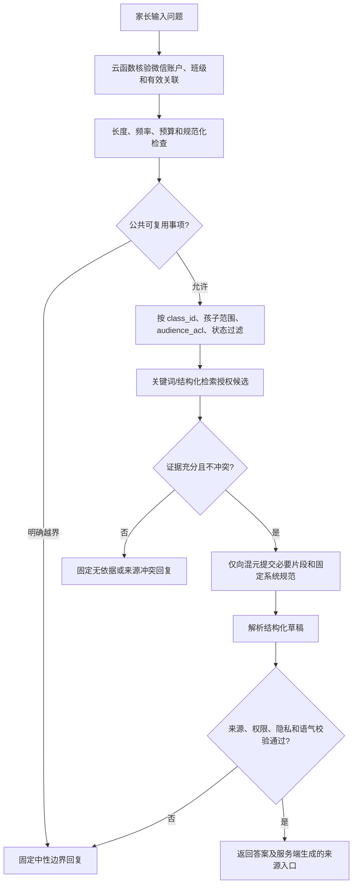

# 腾讯云 AI 能力判断与实施设计

版本 0.6 · 2026-09-10。本文判断需求中的 AI 能力能否由腾讯云提供，并给出可直接进入开发的 CloudBase 实施基线。平台依据为此前已查阅的官方资料，本轮没有重新核验模型可用性；尚未在用户的云开发环境开通模型或运行验证。

## 1. 结论

需求中的 AI 能力可以使用腾讯云体系实现，主方案采用：

- CloudBase 云函数承载鉴权、范围判断、知识检索、模型调用、输出校验和用量控制；
- CloudBase 文档型云数据库保存知识正文、版本、权限、策略和最少审计信息；
- CloudBase AI Node SDK 调用已开通的腾讯混元文本模型；
- 首版使用结构化字段及关键词索引检索，后续按真实效果评估 CloudBase 知识库或语义检索；
- 腾讯云大模型安全可作为附加防护，但不能代替应用自身的权限和家校语气规则。

平台可以提供模型推理、知识检索基础能力和通用安全产品，不会自动实现班级权限、来源有效性、禁止指责、禁止绝对承诺等业务规则。因此本方案技术可行，但不是开箱即用；正式可用取决于云函数编排和验收用例是否通过。

## 2. 能力适配判断

| 需求 | 支持程度 | 采用方式 | 不能交给平台自动决定的部分 |
|---|---|---|---|
| 理解家长自然语言问题 | 支持 | CloudBase AI 调用混元文本模型 | 是否属于产品允许范围 |
| 回答通知、作业、准备事项和活动安排 | 支持 | 检索后生成，仅提交授权片段 | 资料版本、班级及孩子权限 |
| 公共知识库问答 | 支持 | 云数据库首版检索；后续可换 CloudBase 知识库 | 入库审批、失效和删除传播 |
| 给出原通知来源 | 可实现 | 服务端返回受信任的 source_id/version，前端生成详情入口 | 不采用模型生成的 URL 或来源 ID |
| 班级、角色、孩子范围隔离 | 可实现 | 模型调用前由业务云函数过滤 | 不能依赖提示词或模型自行保密 |
| 无资料或资料冲突时拒绝猜测 | 可实现 | 证据门槛与固定回退模板 | 冲突状态由确定性规则判断 |
| 不指责、不羞辱、不绝对承诺 | 可降低风险 | 系统提示、输出规则、语义评测与固定回退 | 不能承诺模型永远不违规 |
| 防止隐私泄露和提示词攻击 | 有配套能力 | 最小数据输入；可选腾讯云大模型安全/内容安全 | 未授权数据从一开始就不得进入模型 |
| 投诉、冲突和敏感个案 | 不调用生成模型 | 输入分流后返回中性固定文案 | 不建工单、不追问、不代转达 |
| 课表、待办、缴费状态等精确数据 | 不应由模型计算 | 业务页面或确定性查询直接展示 | AI 不推断数字、状态和个人原因 |

## 3. 推荐调用链

首版使用单一 `qa` 业务云函数协调流程，不把数据库读取权、通知发布权或财务工具交给模型。



处理顺序是安全边界的一部分：先鉴权和检索，再调用模型。不得把全班知识、名册、缴费表或原始凭证传给模型，再要求它自行忽略无权内容。

## 4. 检索与来源设计

### 4.1 首版检索

当前是单班、小规模、内容短且结构明确的场景，首版使用文档型云数据库即可：

1. 管理者发布知识版本时生成 topic_id/activity_id、标准化关键词、日期、事项类型、事实含义及关联任务；公共资料类别包含入学准备、家长会、阅读和学校确认的家庭教育资料；
2. `qa` 函数先按权限和有效性取有限候选，再做关键词匹配及必要的日期解析；
3. 先识别同一事项及正式替代关系；不同活动的日期不同不判冲突，同事项当前关键事实仍冲突、无法识别关联、候选为空或过期时返回无依据/无法确认，不调用生成模型；
4. 仅将排名靠前且总长度受限的中性片段提交模型。

首版不为了“更智能”立即引入自主 Agent 或复杂向量库。后续只有在常见同义表达召回率达不到验收要求时，才启用 CloudBase 知识库/语义检索。即使知识库支持元数据 Filter，云函数仍要在检索前后各检查一次业务权限。

### 4.2 来源可信链

模型接收的每个片段使用短期内部编号，例如 `S1/S2`。模型只能引用这些编号，返回后由云函数映射到真实 `knowledge_entry_id + version`。云函数检查：

- 来源在本次授权候选集合中；
- 来源仍是 PUBLISHED、ai_eligible 且在有效期内；
- 来源版本未被修订、撤销或权限变更淘汰；
- 回答中的时间、金额、地点等关键事实能在被引片段中找到；
- 前端详情链接由业务路由生成，不接受模型提供的网址。

任务或知识修订时更新 `knowledge_revision`，并使包含旧来源版本的缓存失效。不能只更新展示正文而保留旧向量或旧答案继续使用。

### 4.3 维护人与隐私边界

知识的 owner_id 与原作者、发布者和 authority_level 分开；交接仅修改维护人及有效授权，不让下级改写上级原文。维护有效期、正文或来源关系必须发布新版本并失效缓存。志愿者、代填关联、报名名单、正式授权材料、原始财务信息不进入模型；AI 仅解释经过人工确认、当前有效且获准的公共规则。

## 5. 模型调用契约

`qa` 云函数通过 `@cloudbase/node-sdk` 调用 CloudBase AI。具体模型 ID 不写死为长期产品承诺；部署时从实际环境的已开通列表选择、固定并记录版本。

客户端请求统一为 `{action, payload, requestId}`，requestId 由服务端结合用户及请求摘要幂等处理，以下 action 点号只是“云函数 / action”的简写。

模型输入仅包含：固定系统规范、用户问题的去标识必要内容、授权来源片段和输出格式要求。默认不携带完整聊天历史；确需上下文时，只带本次公共事项所需的有限轮次。

要求模型返回以下逻辑结构；若当前 SDK/模型不提供原生结构化输出，则按 JSON 解析并用应用 Schema 验证，不能直接信任生成文本：

```json
{
  "kind": "ANSWER | INSUFFICIENT_SOURCE | OUT_OF_SCOPE",
  "text": "简短、中性回复",
  "citations": ["S1"],
  "flags": []
}
```

服务端将模型 citations 中的短期编号映射为 `source_refs[{source_id, source_version, title, updated_at, route}]`，并补充可信 answer_id、policy_version、kind、text；前端不得将模型输出的 URL/ID 直接作为引用。缓存正文统一字段 safe_answer，permission_version 来自当前 auth_version 与授权范围摘要。

已收到完整结果但解析/引用/输出校验失败时，在费用与次数预算内最多进行一次受约束重试；仍失败返回固定模板。生成超时或调用结果未知时不盲重调模型，直接安全回退或等待既有作业结果，不能因重试超支。前端不显示未校验的流式片段，首版以完整答案校验通过后一次返回为准。

## 6. 安全与语气控制

本方案使用多层控制，而不是仅写一段提示词：

| 层 | 控制 |
|---|---|
| 输入前 | 长度、频率、敏感字段、越界意图和提示词注入模式检查 |
| 检索前 | 服务端身份、班级、关联、ai_eligible、发布状态和有效期过滤 |
| 模型输入 | 最少授权片段、固定系统规范、无写操作工具 |
| 模型输出 | Schema、引用白名单、关键事实、个人信息、指责、比较、承诺和冒充检查 |
| 失败回退 | 丢弃草稿，返回固定中性模板；不反复生成直到“碰巧通过” |
| 上线控制 | 策略版本、模型版本、用量上限、错误计数、暂停 AI 开关 |

腾讯云大模型安全可以检测通用提示词攻击、内容风险、敏感数据和自定义规则，并提供拦截或安全代答；它属于独立开通和计费的增强项。家校场景的“不要比较家庭”“不要虚构已经通知老师”“不要绝对承诺”等语义规则仍需本项目自行评测和回退。

具体措辞与禁止行为以[AI 回复规范](ai-response-policy.md)为准。AI 永远不获得审批、发布通知、记账、修改缴费、完成待办或替用户联络他人的工具。

## 7. AI 数据结构

| 集合 | 关键字段 | 用途 |
|---|---|---|
| knowledge_entries / knowledge_versions | class_id, owner_id, topic_id, activity_id, source, supersedes_version, audience_acl, ai_eligible, reusable_category, status, valid_from/to, version, body, normalized_terms | 公共知识和不可变版本 |
| knowledge_chunks | source_id, source_version, chunk_no, text, metadata, index_revision | 检索片段；首版可与版本同文档保存 |
| ai_policy_versions | version, system_rule_hash, redline_rules, fallback_templates, status | 策略版本与回退文案 |
| ai_answer_cache | query_key, permission_version, source_versions, policy_version, model_id, safe_answer, expires_at | 仅缓存正常公共问答，任一版本变化即失效 |
| ai_usage_daily | class_id, date, calls, input_tokens, output_tokens, failures, blocked_count | 预算、限流和运营观察 |
| ai_eval_runs | model_id, policy_version, case_set_version, result_summary, released_at | 上线验收证据 |

越界问题默认不保存原文。必要审计仅记录随机请求 ID、分类代码、策略版本、耗时和错误类型；云函数日志不打印问题全文、孩子姓名、知识片段或模型完整响应。

## 8. 接口边界

| 云函数 action | 输入 | 输出/约束 |
|---|---|---|
| qa.ask | payload.child_scope, payload.question；外层 requestId | 同步返回 answer_id、kind、text、source_refs、policy_version，或在时间预算内未结束时返回 job_id；服务端自行取得用户身份 |
| qa.getResult | job_id | 重新鉴权并检查权限/来源版本后返回作业状态，完成时返回与同步一致的结果结构 |
| qa.getSource | answer_id, source_ref | 重新鉴权，返回当前可访问的业务详情入口 |
| knowledge.publishVersion | knowledge_id, draft_version, ai_eligible | 管理权限、同级协作和来源状态检查 |
| knowledge.disableForAI | knowledge_id, expected_revision | 立即阻止新问答使用，异步清理索引和缓存 |
| aiAdmin.setPolicy | policy_version, expected_revision | 系统管理员权限；策略先验收后生效 |
| aiAdmin.pause | reason | 关闭模型生成，保留原文查询和固定回复 |

所有请求都设置长度、频率、单班每日调用次数和 Token 上限。同用户重复的 `requestId` 复用已有作业/结果，调用结果未知时不盲重调模型；不能声称外部服务在超时下严格恰好计费一次；模型调用失败不自动无限重试。

## 9. PoC 与上线门槛

P0 在真实 CloudBase 开发环境完成以下验证，不能用控制台截图代替接口结果：

1. 开通候选混元模型，确认模型 ID、SDK 版本、中文回答质量、超时和 Token 用量；
2. 用模拟班级运行正常问答、无答案、过期来源、冲突来源和跨班越权；
3. 验证知识修订后旧答案和旧检索片段失效；
4. 测试模型超时、限流、解析失败和预算用尽时的固定回退；
5. 确认模型服务的日志、数据保留和地域设置，形成隐私说明；
6. 评估是否接入腾讯云大模型安全，并单列费用和延迟。

发布门槛：[AI01—AI21](ai-response-policy.md) 全部通过；越权泄露、指责羞辱、冒充处理、绝对承诺和无来源编造为零容忍项。另增加：伪造来源 ID 被拒绝、跨班来源不进入模型、知识撤销后缓存失效、模型输出非 JSON 时安全回退、预算耗尽时仍可查原通知。

模型、提示词、检索算法、红线规则或知识切分方式任一变化都需要重新执行固定用例。小规模试用期间保留一键暂停 AI，并允许家长直接查看原通知完成工作。

## 10. 成本与选型边界

成本至少包括模型输入/输出 Token、云函数时间、数据库检索和日志；若启用知识库向量化或腾讯云大模型安全，还会增加独立资源费用。实施前以一班模拟问题测算“每人每天问题数 × 平均上下文长度”，设置日预算和单问题最大上下文，不能把 CloudBase 基础套餐价格当作 AI 总成本。

当前不需要图片生成、语音、多模态或模型工具调用。正式实施先验证文本问答所需能力，付费开通按实际授权执行，避免把非需求能力带入隐私和费用范围。

## 11. 官方依据

- [CloudBase AI Node SDK](https://docs.cloudbase.net/ai/model/nodejs-access)：云函数/Node.js 服务端调用文本模型，提供 generateText、streamText 和 Token 用量。
- [CloudBase Agent 知识库](https://docs.cloudbase.net/ai/agent/knowledgebase)：知识库采用检索后作答，检索实现仍由开发者选择。
- [CloudBase 知识检索接口](https://docs.cloudbase.net/http-api/knowledge/search)：支持相似文本检索及文件元数据 Filter。
- [腾讯云大模型安全](https://cloud.tencent.com/document/product/627/132086)：提供提示词攻击、内容合规、敏感数据和自定义规则防护；需独立确认接入与计费。
- [腾讯云文本内容安全](https://cloud.tencent.com/document/product/1124/59257)：提供通用文本风险和自定义关键词识别，作为附加检查而非业务权限系统。

以上为此前查阅的资料记录，本轮未重新核验当前产品/SDK；它们支持能力适配判断，不代表用户账户已开通、所有模型长期可用或红线自动满足。以实际环境 PoC 和本项目验收记录作为上线依据。
