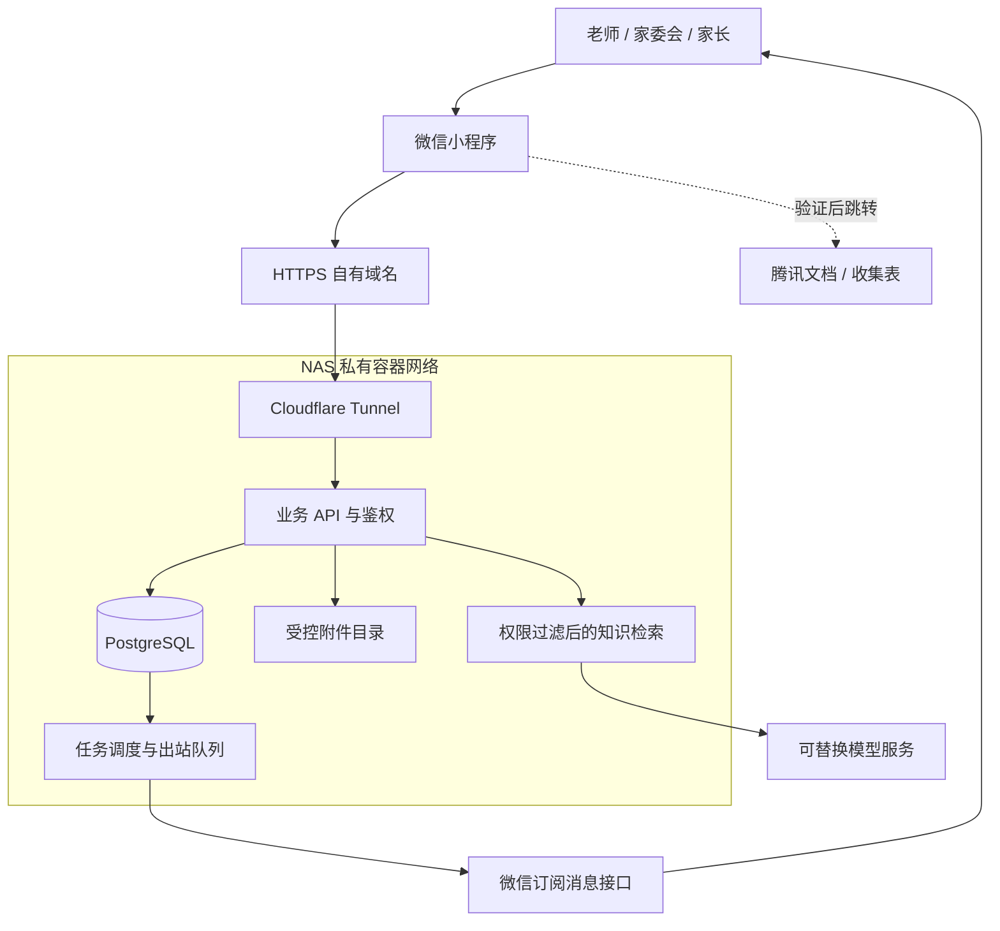
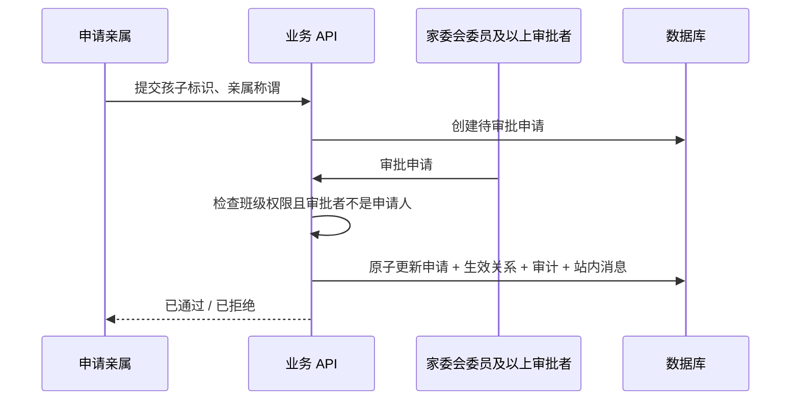
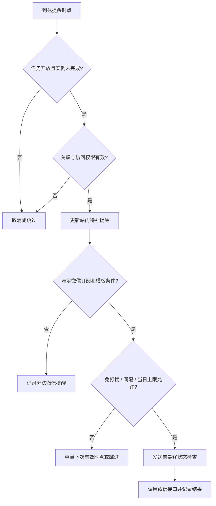

# 技术架构：小程序与 NAS 后端

版本 0.2 · 2026-09-08。以下均为拟实施设计；NAS 型号、运行环境、小程序主体及平台能力尚未验证。

## 1. 总体方案

微信小程序承载亲属与管理入口；业务 API 负责权限和事务；数据库保存事实与回执；调度进程负责提醒；AI 只负责基于授权知识问答。

NAS 不托管小程序代码包，代码包提交微信。拟用 `api.giraffee.top` 作为业务入口，仅为规划名称，尚未配置 DNS、Tunnel 或证书。

## 2. 组件和部署选择

| 组件 | 首版建议 | 目的 |
|---|---|---|
| 客户端 | 原生微信小程序 + TypeScript | 原生身份、订阅授权和任务页面 |
| API | TypeScript / Node.js 服务，框架实施时确定 | 统一权限、审批、任务和统计 |
| 数据库 | PostgreSQL，版本实施时固定 | 单库事务、队列、业务状态与审计 |
| 调度 | 同仓独立 worker 进程 | 持久化提醒、限频、失败恢复 |
| 文件 | NAS 独立业务卷 + 鉴权下载 | 附件、备份、解析原文 |
| 检索 | 首版结构化/关键词；按效果加 pgvector | 先保证权限与版本，再提升语义召回 |
| AI | 可替换模型适配器 | 本地模型或云 API；硬件和服务尚未选定 |
| 入口 | 现有 cloudflared 命名隧道候选 | 复用已有 NAS 连接，仍需小程序域名与实际网络验证 |

不沿用旧方案的模型型号或 Agent Harness 作为既定依赖。无需为首版同时增加 Redis、专用向量库和复杂消息中间件。

## 3. 登录与授权

客户端通过微信登录取得临时代码，由后端完成微信会话交换并签发业务会话。AppSecret 和微信访问凭据只存在服务端；客户端不能自行声明 OpenID、角色或管理员能力。

业务用户以内部 UUID 标识，微信账户使用 `(appid, openid)` 唯一映射，不以昵称识别人，也不假定一定可获得 UnionID。首位系统管理员通过一次性部署初始化与已验证账户绑定。

每个请求重新校验有效账户、班级角色、委托能力和亲属关系；角色/关联撤销触发权限版本更新与缓存失效。授权规则的唯一规范见[身份与权限](permissions.md)。

## 4. 孩子关联流程

审批事件同时驱动开放事项的接收关系同步。失败重试依赖事件 ID 幂等，不重复创建绑定、收件记录或任务实例。

## 5. 发布与分发事务

1. 验证发布权限、任务字段、范围和预览版本。提交时名册/群组已变化则要求重新预览。
2. 在事务中生成任务版本、学生目标快照、完成实例、接收人关联、站内消息、提醒计划和 outbox 事件。
3. 发布返回成功代表业务已保存，微信发送在事务外异步执行。
4. 按目标学生展开有效亲属；同一亲属对应多个目标孩子，保留多个学生完成实例，但同任务同轮次同提醒时点只发一条卡片，详情列出其有权处理的孩子。
5. 无亲属学生保留实例，提醒管理者补齐关系；发送失败不回滚正式通知。

后续新增亲属只同步开放事项。学生移出目标、离班、关联撤销等事件将未完成分配标记撤销并取消待发；已完成历史和撤销原因保留，统计分母按当前有效分配计算并可查看历史快照。

## 6. 完成粒度与采集关联

- `PER_STUDENT`：任务 × 目标学生 × 完成轮次一个实例，任一有效亲属完成，记录真实执行者。
- `PER_RELATIVE`：任务 × 目标学生 × 有效亲属 × 完成轮次一个实例；新审批亲属在开放任务内新增实例，解除关联撤销其未完成实例。
- 关联采集的催办待办使用同一 `completion_source_id`，完成/退回同源联动。仅作上下文链接的待办有独立完成源。
- 外部提交状态、亲属自报、人工核验分开保存；是否必须核验在发布时指定。自报后暂停亲属提醒，核验失败退回后重新计算提醒。
- 完成与调度事务使用同一实例版本/锁顺序。完成接口在提交前再次核对关联资格，不能只依赖页面打开时的旧权限。

## 7. 提醒调度与可靠性

业务层维护持久提醒计划，微信只是其中一个外发渠道。调度每分钟扫描可执行计划，以数据库行锁/租约避免多个 worker 同时取走一条记录。

提醒默认策略见需求 FR-MSG-03。时间计算以 UTC 存储、Asia/Shanghai 展示及计算本地日上限。修改截止时间递增 `schedule_version`，使旧计划失效；重新确认递增 `completion_round`，不抹除旧回执。

幂等键建议：`task_id + completion_round + user_id + schedule_version + slot_id + channel`。多个孩子合并进此用户的 `target_instance_ids`。共享完成源的采集和待办以共同 `notification_group_id` 合并同一事件/时点，不能把不同目的的事项误合并。

微信调用成功只标 `API_ACCEPTED`，不标已读或已完成。临时明确失败采用有上限的退避重试，并检查截止时间；拒绝订阅、模板不可用等转 `BLOCKED`，不循环调用。调用超时或进程在发送后崩溃时转 `UNKNOWN`，在无平台查询/幂等保证时不自动重发该时点，向管理端展示待核对。未来提醒时点仍按有效策略执行。

完成可阻止尚未提交的发送；已进入第三方接口的请求可能与完成同时发生，不能保证卡片撤回。详情页始终展示最新状态。重启不补发整段停机期间的过期提醒，避免突发刷屏。

## 8. 微信订阅适配器

适配器维护模板配置、模板类型、用户授权观测记录、发送尝试及平台返回结果。客户端一次 `accept` 或设置开关不能被当作无限可用发送额度，服务端仍以实际模板权限和接口结果为准。

订阅入口放在发布后相关服务流程、接收任务或主动点击“开启提醒”等适合的用户操作中，不强制订阅才能入班。正式入口和可用模板必须通过真实主体、微信后台和真机验证，详见[平台验证](feasibility-analysis.md)。

服务通知内容使用模板允许字段，默认最小摘要和登录后详情路径。微信凭据集中缓存和刷新，避免各 worker 独立刷新；外发只调用官方接口，NAS 入站隧道不等于微信 API 出站固定 IP，如后台要求白名单需另行核验。

## 9. 腾讯文档适配器

存储 `provider`、文档标识/URL、跳转方式、提交确认模式、验证日期，不默认任何文档 URL 都能内嵌。

按可用性验证：受支持的小程序跳转 → 符合主体和业务域名条件的 web-view → 经真机验证的复制链接/操作指引。每种方式必须验证实际落点和返回体验；只展示无法访问的链接不算完成接入。

首版读取用户配置的链接，用户自行打开填写；应用不抓取外部表单内容。日后如接 API/回调，必须校验服务凭据/签名、事件去重，使用可信 submission ID 与任务/学生/亲属关联，不能依靠姓名匹配。外部文档身份不默认等同于本系统 OpenID。

## 10. 知识库和 AI

通知/活动正式版本与人工知识条目作为来源，提取出的文本片段保留 `source_id`、`version`、班级与学生 ACL、有效时间。所有来源在检索之前完成权限过滤，答案生成前再次确认版本有效。

关键词查询可先行；语义索引与向量是可重建派生数据，不能独立决定权限。尚未完成索引更新时使用数据库当前原文或不回答，不能继续用失效向量。缓存键包含用户权限版本、孩子范围和知识版本。

AI 仅暴露授权检索能力，不提供身份审批、发布、回执修改和通知发送工具。用户问题、上传附件和外部文档均作为不可信文本，不能改变系统权限。引用点击经过业务 API 重新鉴权。

模型超时后返回知识原文入口；来源冲突或没有依据时记录待确认问题。对外部模型只提交已授权且必要的片段，正式接入前确认数据安排；本地模型硬件能力尚未验证。

## 11. NAS 网络和数据保护

- 业务 API 独立容器/目录/凭据，只对隧道开放必要业务端口。数据库、模型、管理后台和 NAS 系统管理端口不直接公开。
- 小程序业务 API 使用业务鉴权；不能依赖会跳浏览器登录页的 Cloudflare Access 保护小程序 API。管理维护入口可另设保护。
- 附件通过受鉴权下载或短期签名地址；目录不自动公开，文件类型/大小限制和访问审计由应用执行。
- 外部链接不允许后端任意抓取内网地址；若以后做导入，单独实现 URL 白名单和 SSRF 防护。
- HTTPS、合法域名、备案、小程序主体审核分别验证，Tunnel 打通不代表满足平台要求。
- 开机启动、故障告警、备份恢复需单独配置，本次没有实施这些操作。

## 12. 运维和恢复目标

首版建议每日数据库与附件一致性备份到另一份受控存储；NAS 快照不能替代异机/离线备份。权限表、关系、任务、回执、outbox、审计共同备份，凭据另行保护。

暂定 RPO ≤ 24 小时、RTO ≤ 4 小时，必须实际恢复验证。恢复后先暂停外发并核对 outbox 与平台可确认结果，无法确认的发送标 UNKNOWN，防止旧备份重发。

监控 API 可用性、Tunnel 状态、队列延迟、无接收人实例、BLOCKED/UNKNOWN 数量、磁盘容量和备份时间；告警不包含孩子正文或家庭信息。

数据保留暂定：正常班级资料按学年维护，学年结束归档；用户退出后移除访问，历史回执按业务保留期清理或去标识。具体期限、删除申请与备份到期清理在试用前由运营负责人确定。

## 13. 费用模块接入

费用服务复用账户、班级、学生、文件、通知和审计，独立维护分摊、核实流水、账本与公示版本。费用金额使用整数分；复核入账与生成公示快照采用数据库事务，账本冲正追加记录。详见[费用规范](finance.md)。

家长原始凭证、财务核对材料和脱敏公示文件分别存储、分别鉴权。用户已选择线下/微信转账收款，第一版不接支付网关。收款信息由家委会人工核对，普通待办的点击完成、AI 输出、截图识别均无权改变核实实收。

AI 的费用查询通过只读公示接口获取数据库计算的金额与版本；班内逐孩子公示信息可供相同权限用户查询，私有家庭任务和原始交易凭证仍隔离。备份恢复需要将账本、公示版本、凭证和复核记录一起校验。
