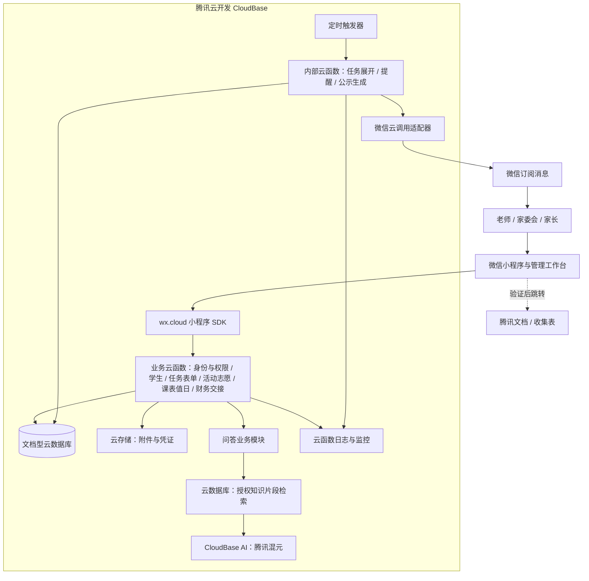
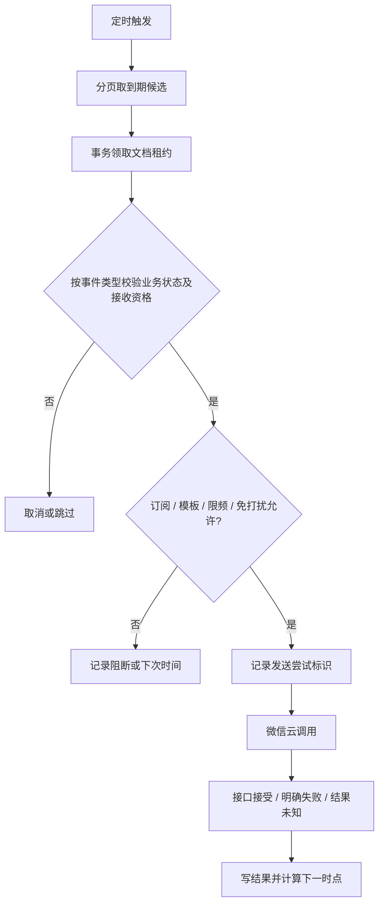

# 技术架构：腾讯云开发 CloudBase

版本 0.6 · 2026-09-10。用户已确定应用后端全部采用腾讯云开发。本文为拟实施设计，尚未创建环境或部署资源。

## 1. 整体架构

微信小程序使用微信云开发接入链路。业务逻辑、数据、文件、提醒调度、知识检索和 AI 调用均运行于腾讯云开发；管理工作台也放在同一个小程序中。

小程序代码包仍通过微信开发者工具上传审核。后台入口使用 `wx.cloud.callFunction`，文件使用云存储 SDK，不部署自建 HTTP API 或配置 `api.giraffee.top`。已有 NAS、Cloudflare Tunnel 与域名不参与本方案运行；原微信群监听备选分支保持原样。

## 2. 技术选型

| 层级 | 已选方案 | 业务用途 |
|---|---|---|
| 前端 | 原生微信小程序 + TypeScript + wx.cloud | 家长操作及管理工作台 |
| 服务端 | CloudBase 云函数，TypeScript 编译为受支持的 Node.js 运行时代码 | 登录身份解析、权限、审批、任务表单、活动报名、交接、财务、问答 |
| 数据 | CloudBase 文档型云数据库 | 业务集合、服务端事务、索引、任务状态和追加账本 |
| 文件 | CloudBase 云存储 | 通知附件、知识原文、私有凭证、脱敏公示文件 |
| 调度 | 云函数定时触发器 + 持久化作业集合 | 分页展开通知、提醒、生成公示、清理与恢复 |
| 微信外发 | 云函数内微信云调用，验证可用后接 subscribeMessage.send | 发送满足订阅条件的提醒 |
| AI | 云函数通过 CloudBase AI Node SDK 调用腾讯混元 | 基于授权片段回答问题，模型 ID 实施时按已开通列表固定 |
| 检索 | 云数据库授权过滤 + 关键词索引集合 | 首版检索，后续语义增强也限定在 CloudBase 能力内 |
| 运维 | 云开发环境配置、函数日志、监控、数据库回档、云存储归档 | 环境隔离、告警、恢复和用量控制 |

首版统一选文档型数据库接入方式，不混用 CloudBase 的关系型/PG 模式 SDK。云托管暂不需要；若附件解析超过云函数限制，后续仅在 CloudBase 云托管内扩展，须先验证当前套餐与运行限制。

## 3. 云环境与部署边界

拟建立开发与生产两个隔离的 CloudBase 环境，按套餐可创建环境数和费用确认。开发环境只放模拟数据，生产集合、文件、模板配置和日志不供开发账户直接读取。环境 ID 按小程序版本固定映射，不接受客户端传入任意目标环境。

代码、集合定义、索引、安全规则、函数运行时、依赖锁文件、定时触发器和非敏感配置均版本化。微信开发者工具负责小程序及对应云函数联调；部署工具版本实施时固定。云开发环境需关联正确 AppID，生产发布前验证真实微信身份和云调用权限。

本架构不需要自有后端域名作为核心接入条件；小程序自身主体、备案、类目审核仍要完成。腾讯文档 web-view 的资格和业务域名要求另行核验，不能因后端采用云开发就认为所有外部网页都能打开。

## 4. 身份与服务端鉴权

小程序初始化目标环境后调用业务云函数。仅在被限制为小程序端调用的入口函数内读取 `wx-server-sdk` 的 `getWXContext()`，以平台提供的 APPID/OPENID 映射内部用户；不使用客户端传入的 openid、角色或管理员标记作为权限依据。

前端入口与定时/内部函数分开部署，避免混合调用来源与实例复用残留身份。不能通过客户端传 `internal=true` 获得内部权限。内部函数由可信触发器或受控服务角色执行，不按 getWXContext 中可能残留的用户身份授权。生产要测试普通客户端直接调用内部函数会被拒绝。

`wx-server-sdk` 负责微信上下文和云调用；业务数据库事务及 AI 模块通过 `@cloudbase/node-sdk` 明确绑定同一环境。二者职责分开，固定并验证兼容版本，不引入另一套前端匿名/自定义登录链路。

普通云开发身份只证明微信账户，不代表班级角色。所有读写都在云函数中按操作检查账户、班级或全局角色、已授权身份、委托能力、对象版本和状态；家庭操作再检查有效亲属关系，管理者不要求关联孩子；全局系统管理员管理免逐班入班。公开阅读、处理对象与外发选择分别检查。日程属于班级共享资源，按 schedule.course.manage 或 schedule.duty.manage 能力检查，能力包含相应发布撤销；任务和知识仍保护上级原文。财务私有读写/复核/公示职责显式指派，角色管理权不等于财务执行权。consent.record 独立检查，普通回执不能写正式授权状态。服务端 SDK 不应依赖客户端数据库规则替代业务鉴权。

首位系统管理员通过一次性部署初始化绑定经核实账户；初始化完成后关闭入口。角色或关联撤销更新权限版本，函数每次调用取当前权限，不能依赖旧页面或热实例缓存。

## 5. 数据与事务边界

文档型数据库用集合、文档 `_id`、显式引用字段和复合索引实现[数据模型](data-model.md)。引用存在性、班级一致性和权限由服务端验证，不假设有关系数据库外键。

本次查阅的官方事务说明支持服务端跨文档事务，同时限制单次操作数/时长，并要求事务内按明确文档 ID 读写。设计采用小事务；发布整班任务不在一个事务里写入全部亲属、回执和通知。实施时按选定 SDK 与环境再次验证实际限制。[官方事务说明](https://docs.cloudbase.net/database/transaction)

- 身份审批：事务读取申请、审批者权限版本、绑定记录，写终态、有效关系与审计/事件。
- 任务发布：先准备不可变对象快照，再以小事务切换已发布版本与创建出站事件。
- 完成回执：事务检查当前任务轮次、实例和关系，写完成事件及实例版本。
- 财务入账：事务写复核终态、有限笔账本条目、账本修订号与公示生成事件。
- 原生答复：检查当前来源、孩子关系、表单/轮次版本，写答复及共享完成事件；外部自报不写原生提交或已核实名额。
- 志愿报名：检查稳定参与人和岗位时段，事务保存唯一报名与容量占位；候补 OFFERED 预留名额，确认/过期/退出使用版本校验释放或转换，避免超额。
- 活动取消与交接：准备完整 READY 清单，生效小事务复核权限和关联版本、切换有效修订；各业务访问即查主修订，后台再分批物化，不能混用旧状态或旧授权。

事务回调内不调用微信、AI、上传下载或其他外部服务，重试不会重复产生外部副作用。唯一操作采用稳定 `_id` 与事务中的“存在则复用/拒绝”，不能使用无条件 set 覆盖既有记录来模拟唯一插入。

## 6. 发布、冻结范围与异步展开

发布版本分离 read_scope、action_audience 和 delivery_policy。先按学生范围计算去重清单，保存不可变 `audience_snapshot`，包含名册/群组版本、人数、快照摘要。单班少量 ID 可放一个受限文档；较大名单分为编号块，完整性检查通过后将 manifest 标记 READY。准备期间源版本变化则提示重做预览。

最终发布事务复核权限、快照 READY 和版本，写任务当前版本及 `outbox_events`。用户看到“已发布，分发中”；云函数分批展开 task_targets、completion_instances、task_recipients 和 inbox_items，分页进度存数据库。全部完成后显示“分发完成”，失败可从游标恢复。

每批使用确定性 ID 幂等写入，校验任务发布版本和完成轮次。任务主版本决定哪些派生记录有效，旧批次不能污染新版本。取消和移出对象先更新主状态/失效版本，旧催办即时失效；移出对象撤销私有任务访问。截止停止催办但不单独撤销阅读，默认仍允许逾期补交；关闭/取消禁止继续提交，历史阅读按当前 ACL 判断。独立 CHANGE_NOTICE 只含必要变更内容，另查原/新范围、当前关联与自身有效期；不能借告知读取原私有正文。后台分页撤销失效物化记录，无须原子遍历全班队列。

按学生或按亲属完成语义保持不变；同一亲属多个孩子的外发可合并，完成实例仍按孩子区分。新增亲属同步开放事项，关系失效阻断新增访问和提醒，无接收人的孩子保留任务实例。

## 7. 提醒调度

定时触发器周期调用 `reminderScheduler`，根据云数据库索引查询 `state + next_due` 的到期计划，限定批次和处理时间。触发频率初定每分钟，实际配置、时区、最小粒度和套餐支持上线前验证。

候选查询可在事务外进行，领取时在事务内按文档 ID 复核状态，写 `lease_owner / lease_until / attempt_token`。租约过期后区分未调用和可能已调用：前者可重领，后者标 UNKNOWN。写回也核对 attempt_token，防止旧实例覆盖新结果。

不假设定时触发只运行一次，不在进程内保存唯一队列或使用常驻循环。临近函数超时时保存游标并退出，后续触发继续；临时目录只作缓存。恢复不集中补发错过时点。

微信外发幂等业务键为 `notification_group_id + event_revision + user_id + schedule_version + slot_id + channel`；记录 subject_type/subject_id、事件类别和目标实例列表，round 仅在有任务完成轮次时填写，不能要求独立变更/催款都伪造任务轮次。

每日预算按 user_id + Asia/Shanghai 日期统一事务预留：跨班总计最多四次，普通初发/周期/催款合计两次，必要变更最多两次，催款另有两次子上限；同任务/轮次普通外发最多两次。手动、自动、摘要和重试均用同一入口，至少两小时间隔、22:00—08:00 免打扰，UNKNOWN 保守占额；明确未发送的失败可按规则释放预留。发送前重新检查家庭主要接收人偏好和订阅；逐亲属确认逐人发送，志愿事项只给当前有效代填责任人。账款催办只读取最新账本/分摊和自报待核对状态，不读取旧公示决定停催。候选时点、摘要合并和截止规则见[需求 FR-MSG](requirements.md)。

明确失败退避且有上限；拒绝订阅/模板问题标 BLOCKED；超时或发送后崩溃标 UNKNOWN，不自动重复该时点。微信接口接受不代表设备展示、已读或已完成；已提交微信的卡片可能与完成并发，详情始终校验当前状态。

## 8. 微信订阅与采集来源

在真实关联环境配置微信云调用权限及消息模板，前端通过 `wx.requestSubscribeMessage` 取得用户操作结果，后端使用已验证的云调用适配器发送。定时函数必须取得正确的关联小程序上下文配置，不依赖家长请求遗留的 OPENID。

云开发简化接入，不增加微信订阅次数或长期订阅资格。保存模板、授权观测、尝试和错误码；一次 accept 不表示无限额度。无订阅条件时保留站内事项并显示无法微信提醒。

采集支持原生简单表单和外部腾讯文档，每表只有一个当前来源。普通家长可答复不能切换整项来源；管理者换源须预览旧答复迁移、生成新修订并保留来源历史。原生答复按学生和轮次留版本，已答“不参加”也完成本次答复。

腾讯文档是外部业务跳转方式。按官方支持路径验证小程序跳转、符合条件的 web-view 或复制链接指引；打开不等于提交。外部模式首版采用关联亲属自报加人工核验，自动同步需要另行验证接口和身份映射。若以后接回调，在 CloudBase 独立 HTTP 云函数完成验签和幂等，不能复用小程序身份入口。

## 9. 云存储与文件权限

附件、知识原文、原始缴费凭证和脱敏公示文件存 CloudBase 云存储。文件业务元数据在云数据库记录 fileID、拥有者、班级、所属对象、版本、用途和审核状态。

核心集合默认禁止客户端直接读写，全部通过业务云函数。上传采用“云函数创建授权上传会话 → 受规则限制的本人暂存路径 → 云函数复核文件元数据并绑定业务对象”，不允许客户端指定任意班级/他人路径。需验证规则阻止跨路径上传、覆盖、列举和删除。

下载先由云函数校验当前对象权限，再签发短期访问链接或使用受控下载。临时链接到期前可能仍可访问，不能声称撤销角色会即时收回已发链接或已下载副本；高敏原始凭证采用更短有效期和受控预览。不能把知道 fileID 当作授权，也不能将全桶设置公开读取。

原始凭证与脱敏公示文件物理分对象，公示接口只返回脱敏对象。未完成上传定期清理；大小/类型/文件元数据核验在云端执行。文件权限与临时链接机制参考[云存储安全规则](https://docs.cloudbase.net/storage/security-rules)和[文件 SDK](https://docs.cloudbase.net/storage/sdk)。

## 10. 知识库与 CloudBase AI

所有知识及版本保存在 knowledge_entries/knowledge_versions；维护 owner_id、topic_id、activity_id、有效期、替代来源和版本。公共资料分类包含入学准备、家长会流程、学校确认的家庭教育资料；到期、撤回、修订和交接须同步有效性及索引缓存。云函数先按公共可复用场景白名单、ai_eligible、账户、班级、孩子范围、来源状态和版本过滤，再检索授权候选。首版使用结构化字段和预计算关键词索引，限制候选数量，避免客户端或模型扫描全库。

`qa` 云函数通过 CloudBase AI Node SDK 调用已开通的腾讯混元文本模型。模型 ID、资源开关、输入长度、超时和每日预算按实际环境固定；不再依赖本地模型主机或独立第三方模型账户。[CloudBase AI 服务端接入](https://docs.cloudbase.net/ai/model/nodejs-access)

后续可使用 CloudBase 内的语义检索/知识库能力增强召回，但必须先验证班级及逐学生 ACL、删除和版本失效过滤；不能只把全库接上 AI Agent 后期待模型自行隔离。未验证时维持应用层授权检索。完整的能力判断、调用链、集合与接口见[腾讯云 AI 能力与实施设计](ai-cloudbase-design.md)。

函数只提交必要授权片段，回答显示来源版本。模型只能引用本次候选的短期编号，真实来源 ID、版本和详情入口由云函数映射并复核。来源修订或权限变化后失效索引与缓存；模型失败仍可查原文、处理任务。先按同主题/同活动和同一事实意义比较来源；不同活动的日期不同不构成矛盾。同一事项有效来源仍矛盾时只说明不能确认，不建立冲突处理流程。AI 无审批、发布、记账、完成或支付工具。费用 AI 仅说明公共用途、规则及查看方式，不提供个人缴费查询；具体缴费/余额与个人值日由有权业务页面展示。问答必须遵守[AI 回复规范](ai-response-policy.md)的输入分流、最少保留、输出语气与来源校验；不设反馈工单或转达工具。

普通云函数调用不假定支持流式前端推送。首版先收集完整模型输出，通过 Schema、引用、权限、隐私和语气校验后一次返回；不向家长展示尚未校验的流式片段。超过同步响应时间预算、但仍在调用次数和费用额度内时转为持久问答作业，返回 job_id，前端经鉴权轮询；费用/次数已耗尽则固定回退，不能借排队绕过预算。不能在函数返回后启动无人持久化的后台 Promise。

## 11. 费用入账与公示一致性

线下/微信转账收款、逐学生班内公示及财务权限均保持[费用规范](finance.md)的用户已确认口径。云函数核验经办与复核人不同，金额为整数分，入账条目追加保存，更正使用冲正。

财务写入保持有界事务：核实流水、分配约束、账本条目、班级 `ledger_revision` 和生成事件一起提交。一个操作超出事务容量时拒绝该批次，先按明确边界拆分经办记录，不把半笔交易标成入账完成。

整班公示不随每次入账在一个事务里重写全部学生。`financePublisher` 按确定账本修订号和分摊版本生成不可变快照，所有金额来自同一截止版本；准备期间有新记录不混入旧快照。完整校验后置 READY，具有 finance.publish 职责且不是原经办人的账户审核选定快照，再用小事务原子切换班级 `published_finance_version`；生成函数不能自行把生成等同发布。家长始终读取完整已发布版本，看到统计截止时间、最新入账与公示是否一致、待生成/待发布状态。最新账本已核实到账立即停催，自报仅暂停并待核对。每条催款固定包含“款项同步可能有延迟，如果已交款请忽略。”

账户权限撤销不删除账本；归档不清空余额。未分配收款、支出、退款、冲正、结转和账目差异沿用费用规范，数据库修订号用于恢复及核对。

## 12. 监控、备份与费用

记录函数调用失败、时长/冷启动、作业游标、租约积压、BLOCKED/UNKNOWN、数据库读写量、云存储用量、AI 资源消耗及预算告警。日志只存必要业务 ID 和错误分类，不打印孩子正文、原始凭证、身份令牌。

数据库使用 CloudBase 可用备份/回档能力；回档生成新集合，需要核对再切换业务数据映射。具体可恢复时间和保留期以控制台为准。云数据库回档不代表云存储文件自动回滚，原文采用版本化不可变对象，并把账本/文件清单及归档副本保存在隔离权限的云开发备份环境中，环境额度和自动化方式先验证。[官方数据库回档说明](https://docs.cloudbase.net/database/backup)

恢复演练在隔离云开发环境进行，核对身份、关联、任务/表单轮次、报名容量及候补、活动修订、交接清单与有效授权修订、正式授权核验、账本、公示和文件清单。旧授权不能因回档重新生效；须核对恢复点之后的变更审计，否则受影响管理操作保持停用待核验。恢复后先暂停外发，重建当日跨班预算和幂等记录，对不确定结果标 UNKNOWN 并保守占额；无法重建当天剩余额度时当天不补发，完成核验后再启调度。暂定 RPO ≤ 24 小时、RTO ≤ 4 小时，需根据实际备份和演练确认。

成本按开发/生产/备份环境、数据库与函数资源、存储下载、日志备份、AI 调用测算。免费体验不作为正式运行保证；开发本身不自动创建付费资源。具体套餐与预算见[可行性分析](feasibility-analysis.md)。

## 13. 官方资料与验证状态

2026-09-08 已查阅 CloudBase 官方云函数、事务、定时配置、AI、存储和回档资料；尚未对用户的具体环境执行验证。实现时固定运行时与 SDK，并记录控制台配置和真机结果。

- [小程序调用云函数](https://docs.cloudbase.net/recipes/add-cloud-function-wechat-miniprogram)
- [云函数与定时配置](https://docs.cloudbase.net/cli-v1/functions/configs)
- [实例复用与微信身份来源](https://docs.cloudbase.net/cloud-function/instance)
- [服务端事务](https://docs.cloudbase.net/database/transaction)
- [CloudBase AI Node SDK](https://docs.cloudbase.net/ai/model/nodejs-access)

## 14. 课程与值日日程服务

`schedules` 云函数负责基础周表、日期实例、临时变更及班内展示，数据存云数据库，定时函数幂等生成未来有效安排和关联提醒。变更计划先完整校验，再以同一已发布修订生效；串课两侧不独立提交。课程和值日实例携带基础版本、例外版本、有效时间和对象快照；旧日程关联提醒通过版本校验失效。详见[课程与值日规范](schedules.md)。

## 15. 活动、志愿与维护服务

`activities` 管理活动及关联清单，取消须有全部必要对象的处理权限；整体修订生效后停止未来执行，费用项目进入 RECONCILING 并标 cancellation_requested，已收款不自动退款。`volunteers` 保存可空账号的 participant_id 和有效关联家长 submitter_user_id；不得只按姓名合并成人，外部自报不占已确认容量，不向未注册成人另建外发通道。

`handover.prepare/acknowledge/revise/activate` 将盘点、接收、修改和生效分开。清单含任务、知识、活动、日程、财务差异和具体角色/委托；修改后旧接收失效。预备授权在 ACTIVE 修订前不能使用；生效统一撤销列明旧权、启用已批准新权，原作者和内容层级不变，账目与家庭关系保留。接收人只可看其受限清单，接收不自动授予管理或财务职责。

`consent` 仅由独立能力记录学校既有正式授权核验，保留说明版本及历史；不提供电子签署。`family.requestRecords` 等受控流程核实历史家庭关系后导出本家庭资料，脱敏文件限时访问，不恢复离班后的全班公示资格。`materials` 在 P6 实施认领、领取、归还和保管记录，关联支出只引用已核对账目，不自动扣款。

服务端命令、字段和状态以[数据模型](data-model.md)统一定义，业务步骤见[协作规范](committee-workflows.md)。现有 Web 原型仅模拟部分状态，平台与业务联合验证见[实施计划](implementation-plan.md)。
