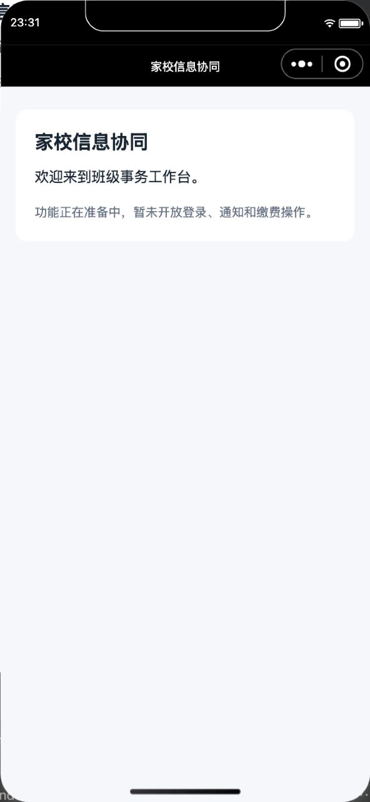

# P0-01 · 正式工程骨架与单元测试入口

状态：**已验收（保留测试号历史页面证据，当前已停用测试号）**；执行者：Codex；日期：2026-09-10。依据：需求/架构基线 0.6、[开发计划](../../docs/development-plan.md#p0-01)，对应 A21 中工程环境部分。

## 实现

原生小程序 TypeScript 空壳、npm workspaces、contracts/domain/cloudbase 共享包、独立 functions、测试目录与配置建立。版本固定为 Node 22.22.1、npm 10.9.4、TypeScript 5.9.3、ESLint 10.10.0；全部依赖见根锁文件。CloudBase CLI 3.8.1，微信开发者工具 2.02.2608031 / CLI skill 0.3.9。

提供 lint/typecheck/build/test:unit/check、覆盖率和原型回归入口；GitHub 工作流调用同一 check。开发构建只打包选定 stage 的公开字段，production 缺配置失败；云函数产物打入共享代码，SDK 以函数独立锁文件安装。构建不会自动部署。

## 实际验证

| 检查 | 实际结果 |
|---|---|
| `npm ci`、最终锁文件重新安装 | 成功 |
| `npm run check` | lint、typecheck、build、单元测试通过 |
| 本包单测 | 配置 4 项、客户端封装 4 项、bootstrap 占位边界 2 项通过 |
| 全部单测 | 32 通过，0 失败/跳过 |
| 负向校验 | 暂时反转“开发/生产不可同环境”条件，check 返回 1、25 项中 3 项失败；已恢复源文件并回归通过 |
| 云函数独立产物 | 将三个函数复制到系统临时目录，脱离仓库 node_modules 加载执行，3 项通过 |
| 生产配置缺失 | `APP_STAGE=production npm run build` 返回 1，无生产构建放行 |
| 尚未实现的测试总入口 | integration/e2e/ai-eval 均返回 1，没有空通过 |
| Web 原型 | 原有 44 项交互断言及 320/390/736 宽度、明暗模式检查通过，未修改原型 |
| 微信模拟器 | 用户选定测试号成功开窗，首页正常；`grep -i error` 无匹配 |

开窗成功不单独算编译通过，以上同时核对了模拟器实际截图与 console 错误查询。自动化运行时表达式出现 `timeout waiting for automator response`，未计为通过；本包空壳无交互业务，以真实页面观察验收。随后专用 `automation_runtime_info/currentPage` 读取成功，确认路径 `pages/index/index`；表达式超时仍按原结果保留。

## 限制

GitHub 远端 CI 未执行，已验证的是其相同本地检查入口及失败传播。bootstrap 返回 NOT_READY，不进行真实用户初始化；业务和可信身份由后续包接入。CloudBase SDK 警告/外部服务失败不属于本包空壳功能已完成的证明。

用户后续停止测试号并选择个人主体正式注册。此操作不会抹除已验证的工程能力；当前不再启动旧测试号，未配置正式 AppID 的开发构建保持云初始化关闭。
